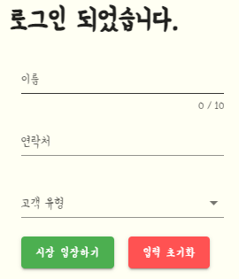

# Sub03 중간평가 산출물
## 1. 프론트엔드 화면구성
*(별도의 데이터없이 화면구성으로만 이루어져 있습니다)* 

 로그인 버튼을 눌러 로그인합니다.  
 
로그인 이후, 별도로 필요한 유저 정보를 입력한 뒤 입장한다. 
 
시장 상점을 카테고리별로 분류한 지도를 확인할 수 있다. 
 
라이브 입장 버튼을 눌러 상점에 들어갈 수 있다. 
 
왼쪽 사이드바에서 시장으로 돌아가거나, 단골등록, 사장님 호출과 같은 기능을 수행할 수 있다.
 
### 네비게이션 바

### 

- 왼쪽 상단 로고 클릭 시 메인페이지로 이동
- 마이페이지 클릭 시 마이페이지(주문내역) 페이지로 이동
- 단골가게  클릭 시 단골가게 페이지로 이동한다

- 클릭 시 장바구니 페이지로 이동한다
- 클릭 시 로그아웃한다 -> 초기 로그인 화면으로 이동
  
  
  

### 시장 선택 바

- 시장을 누르면 이동이 가능하게 만들었습니다.

### 마이페이지 프로세스

- 각 메뉴 페이지로 이동한다.
- 현재 날짜로부터 6개월 동안 거래한 내용만 출력된다.
- 해당 년도에 거래한 내용만 출력된다.
- 검색어를 포함한 상품명이 포함된 거래 내용만 출력된다.
- 주문 내용을 출력한다.
  - 주문일
  - 총 가격
  - 주문 상태
  - 각 상품의 상세 내용을 출력한다.
  - 가게 이름
  - 상품명
  - 상품 수량
  - 상품 가격
  - 요청 메시지
- 주문 상세보기 페이지로 이동한다.

### 회원정보 수정

- 사용자의 정보를 수정한다
  이름
  연락처

  - 작성된 내용을 저장(반영)한다.

    - 회원 가입을 탈퇴한다. 

    

### 단골가게 관리

- 단골 가게를 선택/해제한다
- 선택한 가게를 단골 목록에서 삭제한다.
- 단골 가계의 정보를 출력한다.
- 클릭 시 해당 스토어 라이브로 이동
- 해당 가게를 목록에서 삭제한다.
- 검색한 키워드가 포함된 가게만 목록에 출력한다.

### 결제 프로세스

#### 장바구니

- 해당 상품의 체크를 한다 (true / false)
- 해당 상품의 수량을 선택한다
- 해당 상품을 삭제한다
- 전체 상품을 체크한다
- 체크된 상품을 삭제한다
  선택된 상품을 주문페이지로 보낸다 
-  선택된 상품이 있으면 주문페이지로 보낸다.

#### 주문/결제

- 주문/ 결제 페이지에서 구매자 정보를 확인한다.(이메일은 소셜로그인 메일로 주문/결제 확인 내역을 보내는 역할)

- 주문내역 확인 요청사항 작성

- 결제 정보 창에서 총 결제금액 확인

- 결제 방법 선택(카카오페이, 카드 등)

- 결제하기 버튼 클릭 -> 결제 완료  -> 주문상세 페이지로 이동

 

#### 주문 상세정보

-  결제가 완료되면 사용자는 주문 상세페이지로 이동하여 주문일자, 주문번호 확인

- 주문내역( 제품명, 수량, 가격, 요청사항) 확인

- 결제 정보 확인

- 주문 목록 돌아가기(마이페이지 - 주문내역)

 

