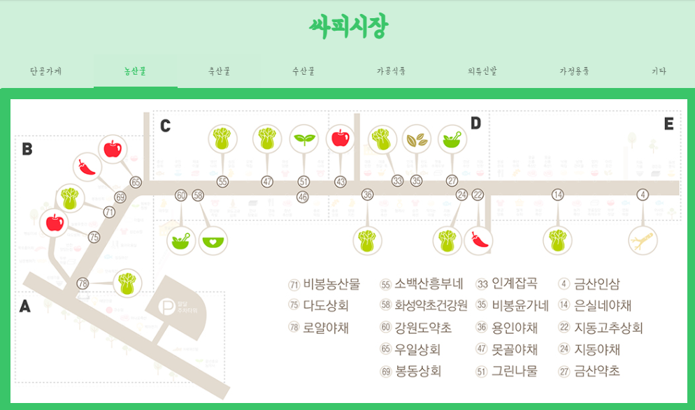
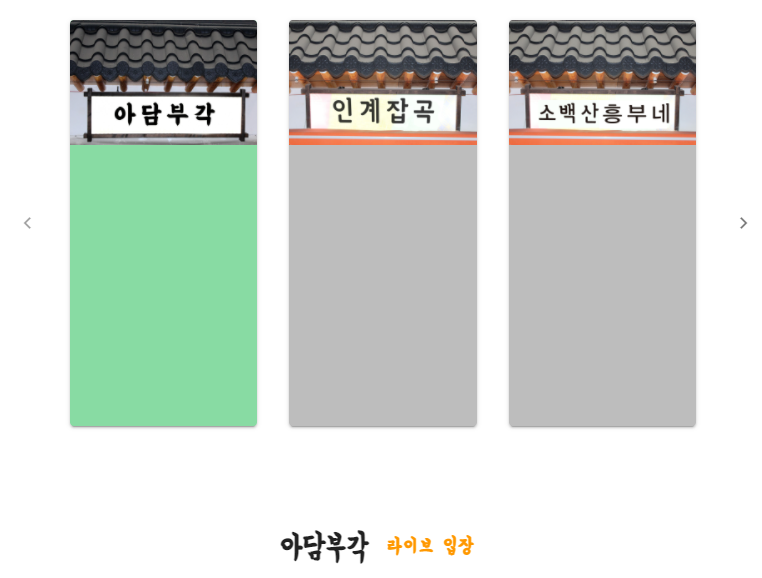
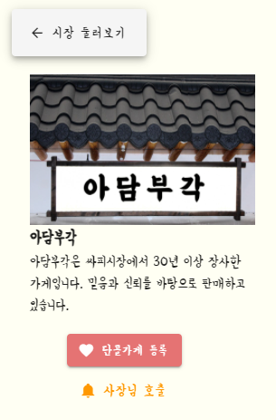
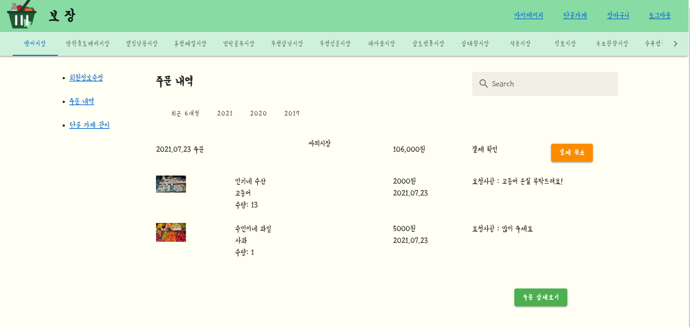
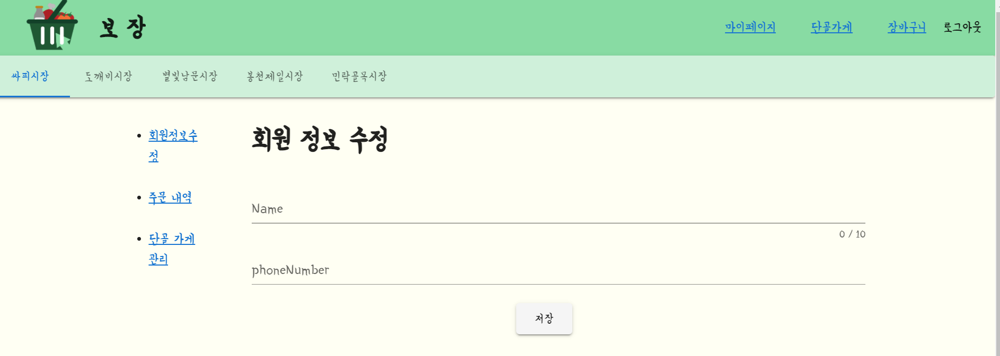
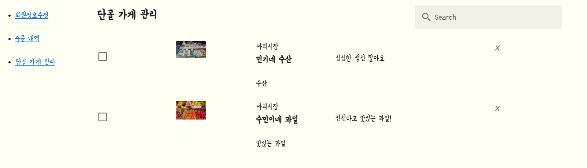
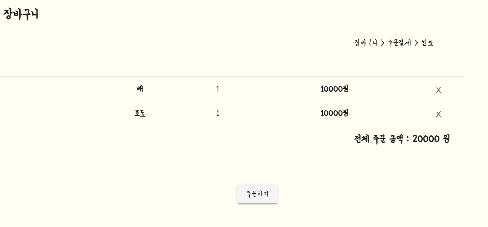
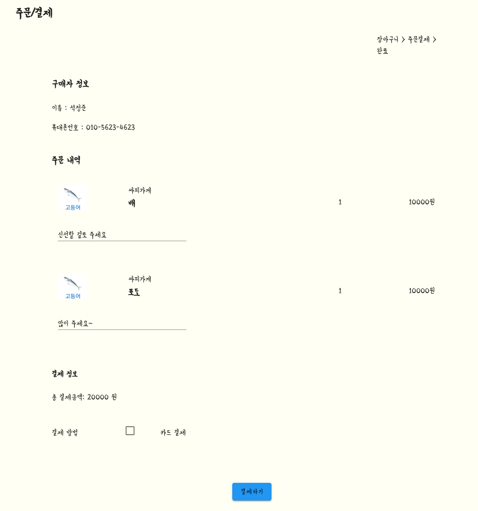
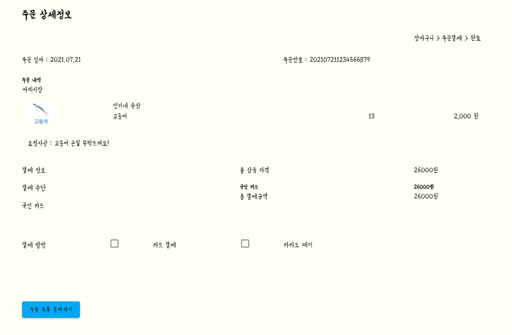

# Sub03 최종평가 산출물

## 보장~!

온라인 재래시장 서비스

## 👨‍👩‍👦팀원 소개 및 역할 소개

**권도엽**

- 🧙‍♂️ 백엔드

**김민기**

- 🍒백엔드

**도태욱**

- 🐶 프론트엔드

**석정준**

- 🌰프론트엔드

## 📆 프로젝트 개요

     

- **진행 기간**: 2021.07.12 ~ 2021.08.20

- **목표**

  - 전통시장 활성화를 위해 WebRTC 기반 온라인 재래시장 서비스 개발합니다.

  - 코로나19로 줄어든 손님과 빨라진 비대면화에 맞는 서비스 개발을 합니다.

  - 고객은 상품을 화상을 통해 직접 확인하며 상품 품질을 확인할 수 있고 판매자는 우수한 품질의 제품을 판매함으로써 고객 신뢰도를 높일 수 있는 계기를 마련했습니다.

    

- **✨3가지 가치**

  - webRtc를 통한 양방향 소통가능
    - 기존 온라인 쇼핑, 홈쇼핑과 다르게 webRtc를 통한 양방향 소통을 통해 시장처럼 소통하여 구매할 수 있는 서비스를 제공합니다.
  - 시장 감성
    - 편리한 온라인 쇼핑몰들이 많은 이 시기에 시장 감성을 추구하며 고객들에게 감성을 불러 일으킵니다.
  - 네이버 장보기, 라이브 커머스 등과 차별점
    - 네이버 장보기와 차이점 : **네이버 장보기는 판매자가 라이브 기능X**
    - 라이브 커머스와 차별점
      - 라이브 커머스는 **방송 시간에만** 양방향 소통 가능
      - 하지만 '보장' 서비스는 **가게 운영시간**에 **고객**이 실시간 소통을 원할 경우 '알림'을 통해 판매자와 소통 가능
      - **당일 픽업이 가능** 반면에 라이브 커머스는 택배 배송을 통해 보장 서비스보다 늦게 도착합니다.

- **✏산출물**

  [기능리스트]: https://docs.google.com/spreadsheets/d/1jPFiw1D0Ss9qQkTguntnnCTb78wFOnO6DXX1WOmDt6o/edit?userstoinvite=cherrytomato2532%40gmail.com&amp;ts=60f61873#gid=0)

- **🖼와이어프레임**

  - [와이어프레임 확인하기]https://docs.google.com/spreadsheets/d/1jPFiw1D0Ss9qQkTguntnnCTb78wFOnO6DXX1WOmDt6o/edit?userstoinvite=cherrytomato2532%40gmail.com&ts=60f61873#gid=0)

- **아키텍쳐 설계 (논리 설계) & 주요기능 시퀀스 다이어그램**

  - [구글독스]: https://docs.google.com/presentation/d/1SUA60uzcmfVP3qtHtJ9eRrG_8HJ7iv8Q_XnEakbKB3g/edit#slide=id.ge54cef4a6d_3_0

    

    

## ✍ 프로젝트 소개

**보장**은 *온라인 재래시장 서비스를 즐길 수 있는 화상 기반 서비스*입니다.

​	코로나 19 바이러스의 대유행 속에서 우리는 불편하고 조심스러운 삶을 살아가고 있습니다. 많은 사람들이 오고가는 전통시장에서 직접 방문하여 구매하기 어려운 요즘, "보장"은 고객과 구매자들에게 주목 받고 있습니다. 실례로 코로나 바이러스가 유행한 이후, 쿠팡의 "로켓배송", SSG닷컴의 "쓱배송", 마켓컬리 등의 주문이 급증하였습니다. 전통시장도 이러한 변화에 발 맞추기 위해 '보장' 서비스가 필요합니다.

  보장 서비스를 통해 고객은 시장에 직접 방문하지 않고 구매자의 라이브방송을 통해 제품을 보면서 구매할 수 있습니다. 이를 통해 소비자도 제품을 품질을 보면서 믿고 살 수 있고, 판매자도 고객의 신뢰도를 얻을 수 있습니다.

​	**보장** 서비스의 또 다른 차별점은 픽업 매니저 서비스입니다. 픽업매니저 서비스를 통해 고객이 주문한 다양한 가게의 제품들을 픽업매니저가 픽업한 후 고객은 주문한 제품을 빠르게 가져갈 수 있습니다. 

​	코로나 19로 인해 비대면 서비스가 활성되는 이 시점에 **보장**을 통해 위기를 극복하고 시장상인, 소비자 모두가 윈윈할 수 있습니다. 

​	**보장**에서 시장감성을 느끼며 시장 나들이를 하면 어떨까요? **보장**이 고객과 상인을 이어주며 전통시장 활성화를 이끌겠습니다.

##  ⭐️ 기능 및 화면구성

### 시장에 온 듯 한 느낌이 드는 화상 서비스

> - 보장은 고객과 판매자가 서로 떨어져 있지만, 시장 분위기를 공유하며 구매와 판매를 동시에 느낄 수 있게 하는 기능을 제공합니다.
>
> - 보장 서비스의 차별점인 픽업매니저를 운영하여 주문이 들어온 것들을 한번에 픽업하여 고객이 주문한 제품을 찾아가기 편리하도록 서비스를 개발하였습니다.

 

- 카카오 로그인 버튼을 눌러 로그인합니다. 

   

   
  시장 상점을 카테고리별로 분류한 지도를 확인할 수 있다. 
   
  라이브 입장 버튼을 눌러 상점에 들어갈 수 있습니다. 
   왼쪽 사이드바에서 시장으로 돌아가거나, 단골등록, 사장님 호출과 같은 기능을 수행할 수 있습니다.
    

### 네비게이션 바

### 

  

- 왼쪽 상단 로고 클릭 시 메인페이지로 이동합니다.

- 마이페이지 클릭 시 마이페이지(주문내역) 페이지로 이동

- 단골가게  클릭 시 단골가게 페이지로 이동합니다

- 클릭 시 장바구니 페이지로 이동합니다

- 클릭 시 로그아웃한다 -> 초기 로그인 화면으로 이동합니다.

  

### 시장 선택 바

- 시장을 누르면 이동이 가능하게 만들었습니다.

### 마이페이지 프로세스

- 각 메뉴 페이지로 이동한다.
- 현재 날짜로부터 6개월 동안 거래한 내용만 출력된다.
- 해당 년도에 거래한 내용만 출력된다.
- 주문 내용을 출력한다.
  - 주문일
  - 총 가격
  - 주문 상태
  - 각 상품의 상세 내용을 출력한다.
  - 상품명
- 주문 상세보기 페이지로 이동한다.

### 회원 정보 수정

- 사용자의 정보를 수정한다
  이름
  연락처

  - 작성된 내용을 저장(반영)합니다.

    

### 단골가게 관리

- 단골 가게를 선택/해제한다
- 단골 가계의 정보를 출력한다.
- 해당 가게를 목록에서 삭제한다.

### 결제 프로세스

#### 장바구니

- 해당 상품을 삭제한다
- 상품을 주문페이지로 보낸다 

#### 주문/결제

- 주문/ 결제 페이지에서 구매자 정보를 확인한다.

- 주문내역 확인 요청사항 작성

- 결제 정보 창에서 총 결제금액 확인

- 결제 방법 선택(카드)

- 결제하기 버튼 클릭 -> 결제 완료  -> 메인 페이지로 이동

  

 

#### 주문 상세정보

-  결제가 완료되면 사용자는 주문 상세페이지로 이동하여 주문일자, 주문번호 확인

-  주문내역( 제품명, 수량, 가격, 요청사항) 확인

-  결제 정보 확인

-  주문 목록 돌아가기(마이페이지 - 주문내역)

 

## ⚙ 개발 환경 및 IDE

## Dependencies

- JDK 1.8

- Spring Boot 2.4.5

- Gradle 6.7

- Swagger 3.0.0

- openvidu : 2.19.0

- Vue.js : 2.6.14

  

### Database

- Spring Data JPA
- MariaDB 10.3.30
- Hibernate
- QueryDSL 4.4
