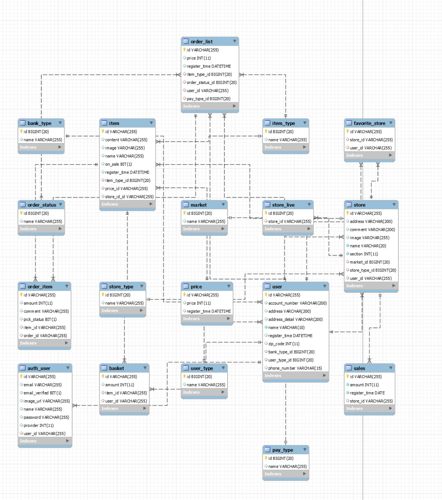

# Back-End

## Dependencies
- JDK 1.8
- Spring Boot 2.4.5
- Gradle 6.7
- Swagger 3.0.0

### Database
- Spring Data JPA
- MariaDB 10.3.30
- Hibernate
- QueryDSL 4.4

## Server

- [Auth Server](./auth/README.md)
- [Item Server](./item/README.md)
- [Store Server](./store/README.md)
- [Billing Server](./billing/README.md)

## Structure

- MariaDB ERD