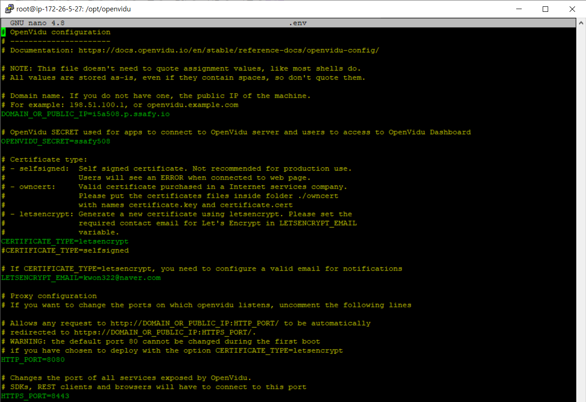
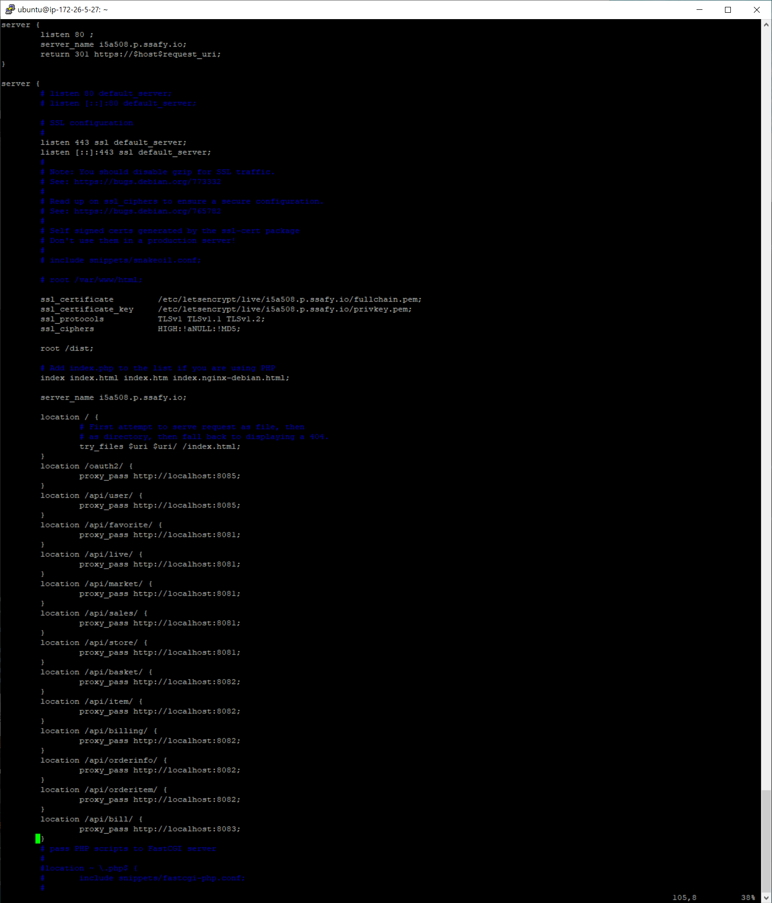

### 1. 프로젝트 개발 환경

- JDK 1.8
- nginx 1.18.0(Ubuntu)
- spring Boot 2.4.5
- Vue 2
- Intellij IDEA Ultimate 2020.3.1
- VsCode 1.59.0
- MariaDB 10.3.31-MariaDB-0ubuntu0.20.04.1

### 2. 빌드 Setting

- gradle 6.7
  1. sudo apt-install wget unzip # wget,unzip 설치
  2. cd /tmp
  3. wget https://services.gradle.org/distributions/gradle.6.7-bin.zip
  4. sudo mkdir /opt/gradle
  5. sudo unzip -d /opt/gradle gradle+-6.7-bin.zip
  6. export PATH=$PATH:/opt/gradle/gradle-6.7/bin
- openVidu 2.19.0
  1. sudo su
  2. cd /opt
  3. cd openvidu
  4. nano .env
     
  5. 해당 내용으로 .env파일 수정
  6. ./openvidu start
- enginx
  1. sudo vi /etc/nginx/sites-available/default
     
  2. 해당 내용으로 수정

### 3. 사용하는 외부 서비스

-[SERVICE.md](SERVICE.md)

### 4. 데이터베이스

-[DATABASE.md](DATABASE.md)

### 5. 시나리오

#### 1. 손님

1. 카카오 로그인 버튼을 누르고 로그인을 한다. -> 메인페이지로 이동(타입 선택X -> 손님)
1. 시장 선택 (현재 서비스 중인 싸피시장 제외 서비스 준비중.)
1. 가게 탭 선택 (농산물, 축산물 등 .. 이미지를 보고, 가게 선택 가능)
1. 가게 페이지

   - 상점 기본정보 제공 -> 단골가게 등록
   - 라이브페이지 -> 라이브 세션이 아닌경우, 준비중 이미지 출력.
   - 판매상품 -> 가게에서 판매중인 상품을 선택해 장바구니에 담을 수 있음

   5. 단골가게관리 페이지에서 회원정보수정 클릭
   6. 이름과 휴대전화번호 형식에 맞게 입력 후 저장 클릭
   7. navbar의 장바구니 페이지 이동
   8. 장바구니 물품 확인(가격, 제품, 가게 등)
   9. 주문하기 클릭
   10. 주문/결제 페이지에서 구매자 정보, 주문내역, 결제금액 확인 후 카드 결제 체크 후 결제하기 클릭
   11. 결제완료 시 메인페이지로 이동
   12. 결제내역 확인 위해 navbar의 마이페이지(주문내역 페이지) 클릭
   13. 주문내역 확인가능 (최근 6개월 등)
   14. 주문 상세보기 버튼 클릭 시 결제 정보 확인 가능
   15. 이후 주문 목록 돌아가기 버튼 클릭
       - 보장 옆 로고 클릭(메인페이지 이동)
   16. navbar의 로그아웃 버튼 클릭(초기 페이지로 이동) → 손님 여정 완료

#### 2. 상인

1. 가게 관리

   - 이름은 변경 불가, 이미지 변경, 설명 변경
   - 판매품목 관리(추가, 수정)

1. 주문 관리

   - 미흡한 기능. 현재 가게에 들어온 주문 관리

1. 판매 금액

   - 기간 선택하여 기간합계 및 일별 금액조회 가능

#### 3. 픽업 매니저

1.  카카오 로그인
2.  navbar 로고 옆에 위치한 픽업관리 클릭
3.  픽업관리 페이지 이동 후 픽업완료 버튼 클릭
4.  로그아웃 클릭
